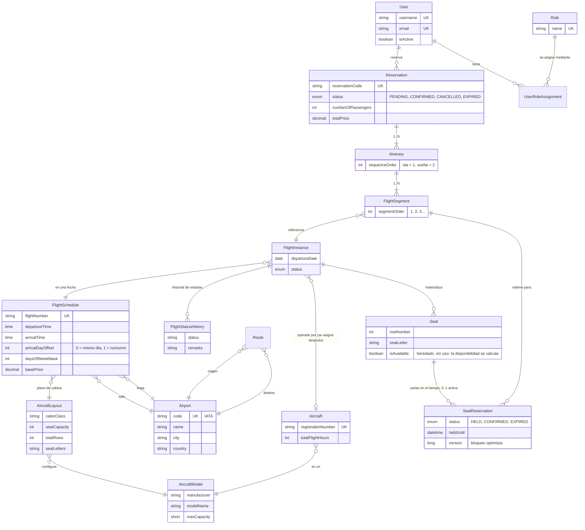
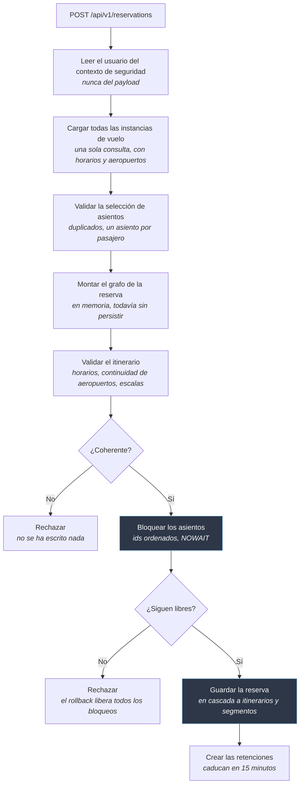
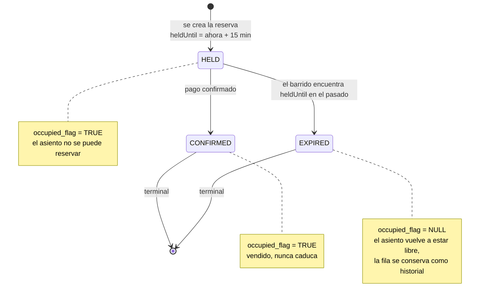

# Flight Booking API ✈️

[](https://github.com/Mek3/flight-booking-api/actions/workflows/ci.yml)

🇬🇧 [English](README.md) · 🇪🇸 **Español**

Es la API backend de un sistema de reservas de una aerolínea.

Hace tres cosas principales. Primero, convierte los horarios de vuelo que se repiten cada semana en vuelos con fecha concreta. Segundo, genera los asientos de cada vuelo. Tercero, gestiona reservas que pueden incluir uno o varios vuelos, comprueba que los horarios son coherentes y garantiza que dos personas no puedan reservar el mismo asiento.

Construí este proyecto para trabajar la parte difícil de las reservas aéreas. No quería hacer otro CRUD de ejemplo.

**Stack:** Java 17 · Spring Boot 3.5 · MySQL 8 · Redis · Spring Security (JWT) · Flyway · ShedLock · Testcontainers

📖 **[Documentación](https://github.com/Mek3/flight-booking-api/wiki)** · 🧭 **[Decisiones técnicas](https://github.com/Mek3/flight-booking-api/wiki/Technical-Decisions)**

---

## Modelo de dominio



**La regla principal del modelo:** un itinerario contiene los vuelos de un solo trayecto.

Un viaje de ida y vuelta tiene *dos* itinerarios dentro de la misma reserva, no cuatro segmentos en un único itinerario. El motivo es sencillo: los días que pasan entre el vuelo de ida y el de vuelta no son una escala. Si los juntara, la validación rechazaría reservas que son correctas.

Un vuelo directo es un itinerario con un solo segmento. No es un caso especial: es la misma estructura con un único elemento.

---

## Ejemplo: ida y vuelta con escala

```http
POST /api/v1/reservations
Authorization: Bearer <token>
```

```jsonc
{
  "numberOfPassengers": 2,
  "itineraries": [
    { "flightSegments": [
        { "flightInstanceId": 101, "seatIds": [4501, 4502] },   // ALC → MAD
        { "flightInstanceId": 205, "seatIds": [8830, 8831] }    // MAD → JFK, la escala
    ]},
    { "flightSegments": [
        { "flightInstanceId": 412, "seatIds": [9120, 9121] }    // JFK → ALC, directo
    ]}
  ]
}
```

Dos itinerarios: la ida tiene una escala y la vuelta es directa. El orden de los segmentos sale de su posición en la lista, así que el cliente no puede enviar un orden contradictorio. Un asiento por pasajero en cada segmento.

```jsonc
{
  "id": 88,
  "reservationCode": "3EA31A83",
  "status": "PENDING",                    // asientos retenidos, todavía sin pagar
  "numberOfPassengers": 2,
  "totalPrice": 1500.00,                  // suma de las tres tarifas × 2 pasajeros
  "itineraries": [
    {
      "sequenceOrder": 1,                 // ida
      "segments": [
        { "segmentOrder": 1, "flightNumber": "IBE-101",
          "departureAirport": "ALC", "departureAt": "2026-10-15T08:00:00",
          "arrivalAirport": "MAD",   "arrivalAt": "2026-10-15T09:00:00" },

        // 90 minutos en Madrid, por encima del mínimo de conexión de 45 minutos
        { "segmentOrder": 2, "flightNumber": "IBE-205",
          "departureAirport": "MAD", "departureAt": "2026-10-15T10:30:00",
          "arrivalAirport": "JFK",   "arrivalAt": "2026-10-15T18:30:00" }
      ]
    },
    {
      "sequenceOrder": 2,                 // vuelta, siete días después: no es una escala,
      "segments": [                       // y por eso es un itinerario aparte
        { "segmentOrder": 1, "flightNumber": "IBE-412",
          "departureAirport": "JFK", "departureAt": "2026-10-22T21:00:00",
          "arrivalAirport": "ALC",   "arrivalAt": "2026-10-23T11:00:00" }
          // sale a las 21:00 y aterriza a las 11:00 del día siguiente: el horario
          // lo guarda como un desfase de día de llegada, y la API no tiene que adivinarlo
      ]
    }
  ]
}
```

Los segmentos no guardan horas propias: las leen de la instancia de vuelo. Si un vuelo cambia de horario, se refleja sin tocar ningún dato de la reserva.

Todo el viaje se valida antes de escribir nada. Un segmento que sale antes de que aterrice el anterior, o desde un aeropuerto al que el pasajero nunca llega, hace fallar la petición sin guardar nada.

---

## Cómo se crea una reserva



**Lo importante es el orden.** Todo lo que puede fallar por un motivo que no sea la concurrencia falla antes de tomar un solo bloqueo, así que los bloqueos duran lo mínimo posible. Y como el grafo se monta en memoria, una reserva rechazada no deja nada detrás: la garantía no depende de un rollback.

---

## Ciclo de vida de la retención de un asiento

Una fila de `seat_reservation` es lo que hace que un asiento no esté disponible. Lo que retiene el asiento es su estado, no su existencia.



**`occupied_flag` es una columna generada**: vale `TRUE` mientras el estado es `HELD` o `CONFIRMED`, y `NULL` en cualquier otro caso. Un índice `UNIQUE` sobre `(seat_id, occupied_flag)` permite por tanto una sola reserva activa por asiento, y como MySQL no considera que dos `NULL` colisionen, una retención caducada libera su asiento sin borrar la fila.

**Los dos estados finales son terminales**, y así se resuelve la carrera entre la caducidad y el pago: una retención confirmada instantes antes de que pase el barrido ya no está en `HELD`, así que el barrido no la encuentra, y la máquina de estados rechazaría la transición aunque la encontrara.

**Una columna de versión protege las propias transiciones.** El barrido de caducidad y la confirmación del pago son dos transacciones independientes que leen y escriben la misma fila. Sin versión, un pago que se confirmara entre el `SELECT` del barrido y su `UPDATE` quedaría pisado con `EXPIRED`, y la máquina de estados no lo detectaría, porque la entidad que tiene el barrido en memoria todavía cree que está en `HELD`.

---

## 🏆 Cuatro partes con tests

**Bloqueo de asientos probado bajo concurrencia**

Veinte hilos compiten por el mismo asiento y gana exactamente uno. Otro test lanza dos transacciones que piden los mismos asientos en orden inverso y comprueba que ninguna queda en interbloqueo, porque los ids de asiento se ordenan antes de tomar los bloqueos.

Estos tests encontraron dos errores reales que una revisión de código no habría detectado.

El primero: el bloqueo funcionaba, pero la comprobación de disponibilidad que venía después leía la instantánea del inicio de la transacción, porque MySQL usa `REPEATABLE READ` por defecto. La segunda transacción tomaba el bloqueo, veía libre un asiento que ya estaba retenido, e insertaba. Lo que de verdad impedía la sobreventa era la restricción única, no el bloqueo.

El segundo: el tiempo máximo de espera del bloqueo nunca se aplicaba. MySQL no admite un timeout por sentencia, así que Hibernate descartaba el valor sin avisar y la petición esperaba los cincuenta segundos por defecto del servidor.
→ `SeatLockingConcurrencyIntegrationTest.java`

**Generación de asientos idempotente**

Un `@DataJpaTest` ejecuta dos veces la inserción masiva de asientos contra una instancia real de MySQL y comprueba que el número de asientos no cambia. El test demuestra la idempotencia en la base de datos, no solo en el código.
→ `SeatRepositoryJpaTest.java`

**Reglas de itinerario sin el framework**

La validación de horarios, aeropuertos y escalas trabaja sobre un record de Java, no sobre entidades JPA.

Gracias a eso puedo probar todas las reglas sin contexto de Spring y sin base de datos. Son dieciséis casos que se ejecutan en milisegundos. Dos ejemplos: una escala que dura exactamente el tiempo mínimo de conexión, y un vuelo que cruza la medianoche.
→ `RoutingValidatorTest.java`

**Una restricción única compatible con el borrado lógico**

Las reservas de asiento tienen un índice `UNIQUE` sobre una columna generada, que vale `NULL` cuando el asiento se libera. MySQL no considera que dos `NULL` colisionen.

Así, cuando una retención caduca, el asiento queda libre para una reserva nueva, pero la fila antigua se conserva como historial.

La solución obvia, una restricción sobre `(asiento, segmento)`, no funciona. Dos reservas del mismo vuelo crean dos filas de segmento distintas, así que esa restricción permitiría vender el mismo asiento dos veces.
→ `V*__add_seat_reservation.sql`

---

## Decisiones de diseño

**Calcular, no almacenar.** No guardo en la base de datos la disponibilidad de asientos, los tiempos de escala ni la duración total del viaje: los calculo a partir de los datos del vuelo. Nada se queda obsoleto, porque nada está duplicado. Si un vuelo se retrasa, todos los valores calculados siguen siendo correctos.

**Dos estrategias de bloqueo, elegidas según el patrón de contención.** La asignación de asientos usa bloqueo pesimista: la transacción abarca varios asientos en varios aviones, así que un conflicto detectado al escribir el último desperdicia todo el trabajo anterior. Merece la pena esperar para evitarlo.

Las transiciones de estado de una retención usan bloqueo optimista. El job de caducidad y un pago casi nunca coinciden, y cuando lo hacen no hay nada que reintentar: uno de los dos simplemente llegó tarde. Bloquear un hilo por un conflicto que casi nunca ocurre, y que no tiene recuperación, no aporta nada.

Ninguna de las dos es la herramienta adecuada si el sistema asigna cualquier asiento libre en lugar de que el cliente elija uno. Ese caso pide `FOR UPDATE SKIP LOCKED`, para que cada proceso coja un asiento distinto en vez de competir por el mismo.

**La base de datos también protege los datos.** Cada regla de idempotencia y unicidad tiene una restricción en base de datos, no solo código de aplicación. Uso `INSERT IGNORE` con un índice único para los asientos, una columna generada `active_flag` para las instancias de vuelo, y ShedLock para los jobs programados. Si alguien se salta el código de la aplicación, o si falla un bloqueo, los datos siguen siendo correctos.

**Las reglas de negocio están separadas del framework.** El validador de itinerarios recibe un record y devuelve un resultado. No sabe nada de JPA, de Spring ni de repositorios, y por eso sus tests no los necesitan.

**Todos los errores tienen el mismo formato.** Los errores de seguridad ocurren en la cadena de filtros, antes del `DispatcherServlet`, así que `@RestControllerAdvice` no puede capturarlos.

Añadí un entry point propio para los 401 y un manejador de acceso denegado para los 403. Los dos usan el mismo componente de respuesta y el mismo `ObjectMapper` que los controladores. El cliente no puede distinguir por la respuesta si el error viene de un filtro o de un controlador.

---

## 🗺️ Hoja de ruta

* ✅ **Sprint 5 — Fundamentos:** datos estáticos (`airport`, `route`, `aircraft_model`, `aircraft`, `user`), más la configuración de Flyway y JPA.
* ✅ **Sprint 6 — Calendarios y asientos:** generador idempotente de instancias de vuelo y creación masiva de asientos.
* ✅ **Sprint 7 — Itinerarios y motor de reservas:** itinerarios con varios segmentos, validación de itinerarios, bloqueo atómico de asientos entre segmentos y carrito de reserva con caducidad.
* 🔜 **Sprint 8 — Spring Batch:** importación y exportación por bloques de ficheros CSV y XML grandes, con una tabla de errores para las filas inválidas.
* 🔜 **Sprint 9 — Arquitectura orientada a eventos:** un `BookingConfirmedEvent` y un servicio independiente que lo consume. Ambos se ejecutan con Docker Compose.
* 🔜 **Sprint 10 — Frontend mínimo:** tres pantallas en Angular que consumen esta API.

### Fuera del alcance a propósito

Prefiero dejar estas decisiones por escrito en vez de ocultarlas. Decidir dónde parar también forma parte del diseño.

* **Billetes, cupones y el dominio financiero** (facturas, reembolsos, equipaje, precios dinámicos). El motor de reservas es el problema interesante de este proyecto. La facturación es un problema que mucha gente ya ha resuelto.
* **`Passenger` como entidad propia.** Una reserva guarda el número de pasajeros, no el nombre de cada uno. El bloqueo de asientos compite por asientos, así que un número genera la misma contención. Lo que falta son billetes nominativos.
* **Revocación de tokens, límite de intentos de login y tokens de refresco.** Los tres necesitan almacenamiento compartido, lo que reintroduce el estado que un diseño sin estado intenta evitar. Son decisiones, no olvidos.
* **Stack de observabilidad y un asistente con IA.** Los dos son útiles, pero no son el objetivo de este proyecto.

---

## ⚙️ Cómo ejecutarlo

**Necesitas:** JDK 17, MySQL y Redis en tu máquina, y Docker para los tests.

Si no tienes Redis instalado, basta con un contenedor:

```bash
docker run -d --name redis-local -p 6379:6379 redis:7
```

Después arranca la aplicación:

```bash
# Los secretos van en variables de entorno. Nada está en el código, nada se sube al repositorio.
export DB_LOCAL_USER=root DB_LOCAL_PASSWORD=root JWT_SECRET_LOCAL=<tu-secreto>

mvn spring-boot:run -Dspring-boot.run.profiles=local
```

En Windows PowerShell, lo equivalente:

```powershell
$env:SPRING_PROFILES_ACTIVE="local"
$env:JWT_SECRET_LOCAL="<tu-secreto>"
.\mvnw spring-boot:run
```

Flyway crea el esquema y los roles al arrancar la aplicación. Con el perfil `local`, un seeder rellena después una base de datos vacía con datos de demostración: cuatro aeropuertos, una ruta con escala, un vuelo de vuelta nocturno, una ruta nacional, siete días de vuelos con sus asientos, un usuario de demo y una reserva.

El seeder solo se ejecuta cuando la tabla `airports` está vacía, así que reiniciar la aplicación nunca duplica datos. Para volver a cargarlo, vacía antes la base de datos.

```bash
mvn test
```

Testcontainers crea contenedores temporales de MySQL, ejecuta los tests y los elimina. No necesitas ninguna configuración manual, y los tests se comportan igual en tu máquina que en CI.

**Documentación de la API:** Swagger UI en `/swagger-ui.html` con la aplicación en marcha.

### Autenticación

Usa `POST /api/v1/auth/register` o `/api/v1/auth/login`, y envía después el JWT como token Bearer.

Con el seeder local puedes iniciar sesión directamente:

```json
{ "username": "demo", "password": "demo1234" }
```

En Swagger UI, pega el token en el botón **Authorize** de la parte superior de la página. A partir de ahí, todas las peticiones que hagas desde Swagger lo llevan.

`ROLE_ADMIN` gestiona la infraestructura: aeropuertos, aviones, rutas y horarios. `ROLE_USER` busca vuelos y gestiona sus propias reservas.