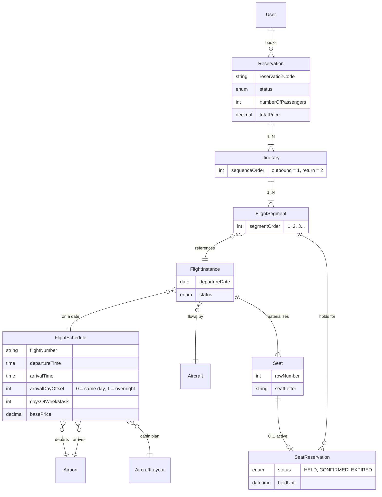
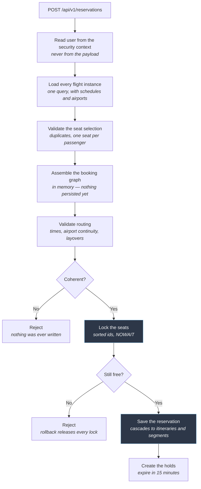
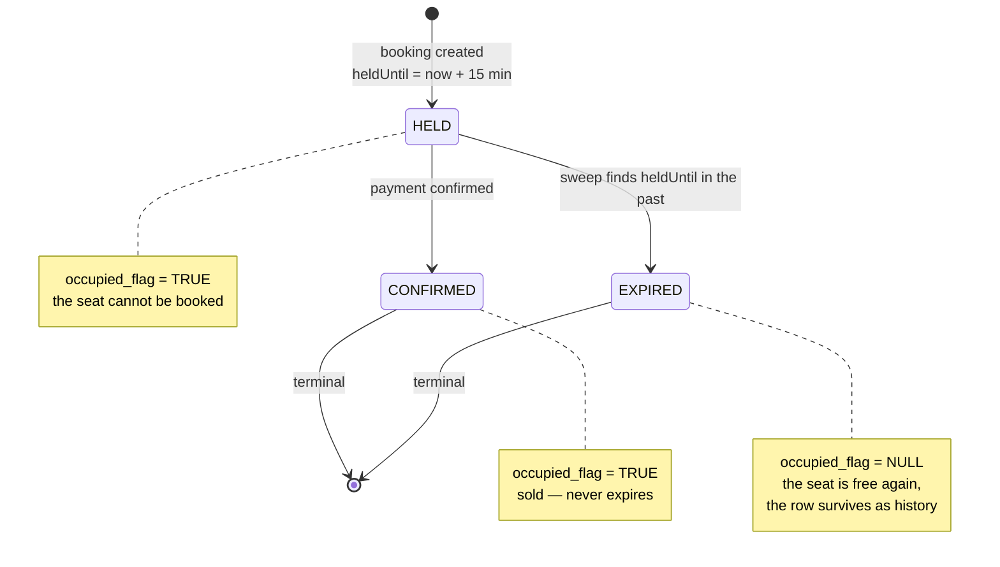

# Flight Booking API ✈️

[](https://github.com/Mek3/flight-booking-api/actions/workflows/ci.yml)

This is a backend API for an airline booking system.

It does three main things. First, it takes flight schedules that repeat every week and creates flights on specific dates. Second, it creates the seats for each flight. Third, it handles bookings that can have one or more flights, checks that the times are correct, and makes sure two people cannot book the same seat.

I built this project to work on the difficult parts of airline booking. I did not want to build another simple CRUD example.

**Stack:** Java 17 · Spring Boot 3.5 · MySQL 8 · Redis · Spring Security (JWT) · Flyway · ShedLock · Testcontainers

📖 **[Documentation](https://github.com/Mek3/flight-booking-api/wiki)** · 🧭 **[Technical decisions](https://github.com/Mek3/flight-booking-api/wiki/Technical-Decisions)**

---

## Domain model



**The main rule of the model:** one itinerary has the flights of one trip.

A round trip has *two* itineraries in the same reservation. It does not have four segments in one itinerary. The reason is simple: the days between the outbound flight and the return flight are not a layover. If I put them together, the validation would reject bookings that are correct.

A direct flight is an itinerary with only one segment. It is not a special case. It is the same structure with one element.

---

## Example: a round trip with a connection

```http
POST /api/v1/reservations
Authorization: Bearer <token>
```

```jsonc
{
  "numberOfPassengers": 2,
  "itineraries": [
    { "flightSegments": [
        { "flightInstanceId": 101, "seatIds": [4501, 4502] },   // ALC → MAD
        { "flightInstanceId": 205, "seatIds": [8830, 8831] }    // MAD → JFK, the connection
    ]},
    { "flightSegments": [
        { "flightInstanceId": 412, "seatIds": [9120, 9121] }    // JFK → ALC, direct
    ]}
  ]
}
```

Two itineraries: the outbound has a connection, the return is direct. Segment order comes from the position in the list, so a client cannot send an order that contradicts itself. One seat per passenger on every segment.

```jsonc
{
  "id": 88,
  "reservationCode": "3EA31A83",
  "status": "PENDING",                    // seats are held, not yet paid
  "numberOfPassengers": 2,
  "totalPrice": 1500.00,                  // sum of the three segment fares × 2 passengers
  "itineraries": [
    {
      "sequenceOrder": 1,                 // outbound
      "segments": [
        { "segmentOrder": 1, "flightNumber": "IBE-101",
          "departureAirport": "ALC", "departureAt": "2026-10-15T08:00:00",
          "arrivalAirport": "MAD",   "arrivalAt": "2026-10-15T09:00:00" },

        // 90 minutes in Madrid — above the 45 minute minimum connection time
        { "segmentOrder": 2, "flightNumber": "IBE-205",
          "departureAirport": "MAD", "departureAt": "2026-10-15T10:30:00",
          "arrivalAirport": "JFK",   "arrivalAt": "2026-10-15T18:30:00" }
      ]
    },
    {
      "sequenceOrder": 2,                 // return, seven days later — not a layover,
      "segments": [                       // which is why it is a separate itinerary
        { "segmentOrder": 1, "flightNumber": "IBE-412",
          "departureAirport": "JFK", "departureAt": "2026-10-22T21:00:00",
          "arrivalAirport": "ALC",   "arrivalAt": "2026-10-23T11:00:00" }
          // departs 21:00, lands 11:00 the next day: the schedule stores that
          // as an arrival day offset, so the API never has to guess it
      ]
    }
  ]
}
```

Segments store no times of their own — they read them from the flight instance. A rescheduled flight is reflected without touching any booking data.

The whole trip is validated before anything is written. A segment that departs before the previous one lands, or from an airport the passenger never reaches, fails the request with nothing saved.

---

## How a booking is created



**The order is the point.** Everything that can fail for a reason other than
concurrency fails before a single lock is taken, so locks are held for as little
time as possible. And because the graph is assembled in memory, a rejected
booking leaves nothing behind — the guarantee does not depend on a rollback.


## Seat hold lifecycle

A `seat_reservation` is the row that makes a seat unavailable. Its state — not its
existence — is what holds the seat.



**`occupied_flag` is a generated column**, `TRUE` while the status is `HELD` or
`CONFIRMED` and `NULL` otherwise. A `UNIQUE` index over `(seat_id, occupied_flag)`
therefore allows one active reservation per seat, and — because MySQL does not treat
`NULL`s as colliding — an expired hold frees its seat without the row being deleted.

**Both end states are terminal**, which is how the race between expiry and payment
resolves: a hold confirmed moments before the sweep runs is no longer `HELD`, so the
sweep does not match it, and the state machine would refuse the transition even if it
did.

**A version column guards the transitions themselves.** The expiry sweep and payment
confirmation are two independent transactions reading and writing the same row. Without
a version, a payment committing between the sweep's `SELECT` and its `UPDATE` would be
overwritten with `EXPIRED` — and the state machine would not catch it, because the entity
the sweep holds still believes it is `HELD`.

---

## 🏆 Four parts with tests

**Seat locking proven under concurrency**

Twenty threads compete for the same seat and exactly one wins. Another test sends two transactions asking for the same seats in the opposite order and checks that neither deadlocks, because the seat ids are sorted before the locks are taken.

These tests found two real bugs that a code review would not have caught.

The first: the lock was working, but the availability check that came after it read the snapshot from the start of the transaction, because MySQL runs `REPEATABLE READ` by default. So the second transaction took the lock, saw a seat that was already held as free, and inserted. What actually stopped the overselling was the unique constraint, not the lock.

The second: the lock timeout was never applied. MySQL has no per-statement timeout, so Hibernate dropped the value without any warning and the request waited the fifty second server default.
→ `SeatLockingConcurrencyIntegrationTest.java`

**Idempotent seat generation**

A `@DataJpaTest` runs the bulk seat insert two times against a real MySQL instance. Then it checks that the number of seats is the same. So the test proves idempotency in the database, not only in the code.
→ `SeatRepositoryJpaTest.java`

**Routing rules without the framework**

The validation of times, airports and layovers works on a plain Java record. It does not work on JPA entities.

Because of this, I can test all the rules without a Spring context and without a database. There are sixteen test cases and they run in milliseconds. Two examples: a layover exactly on the minimum connection time, and a flight that crosses midnight.
→ `RoutingValidatorTest.java`

**A unique constraint that works with soft deletes**

Seat reservations have a `UNIQUE` index on a generated column. This column is `NULL` when the seat is released. MySQL does not see two `NULL` values as a collision.

So when a hold expires, the seat is free for a new reservation, but the old row stays in the table as history.

The obvious solution, a constraint on `(seat, segment)`, does not work. Two bookings on the same flight create two different segment rows. So that constraint would allow selling the same seat two times.
→ `V*__add_seat_reservation.sql`

---

## Design decisions

**Calculate, do not store.** I do not save seat availability, layover times or total travel time in the database. I calculate them from the flight data. Nothing becomes old, because nothing is duplicated. If a flight is delayed, every calculated value is correct.

**Two locking strategies, chosen by the contention pattern.** Assigning a seat uses pessimistic locking: the transaction covers several seats on several aircraft, so a conflict found when writing the last one throws away all the work done before it. Preventing that conflict is worth waiting for.

The state transitions of a hold use optimistic locking. The expiry job and a payment almost never collide, and when they do there is nothing to retry — one of them was simply too late. Blocking a thread for a conflict that rarely happens, and that has no recovery, gives nothing back.

Neither is the right tool if the system assigns any free seat instead of the customer choosing one. That case wants `FOR UPDATE SKIP LOCKED`, so each process takes a different seat instead of competing for the same one.

**The database also protects the data.** Every idempotency and uniqueness rule has a database constraint, not only application code. I use `INSERT IGNORE` with a unique index for the seats, a generated `active_flag` for flight instances, and ShedLock for the scheduled jobs. If somebody skips the application code, or if a lock fails, the data is still correct.

**Business rules are separate from the framework.** The routing validator receives a record and returns a result. It knows nothing about JPA, Spring or repositories. This is why its tests do not need them.

**All errors have the same format.** Security errors happen in the filter chain, before the `DispatcherServlet`. So `@RestControllerAdvice` cannot catch them.

I added a custom entry point for 401 errors and an access denied handler for 403 errors. Both use the same responder and the same `ObjectMapper` as the controllers. The client cannot see from the response if the error comes from a filter or from a controller.

---

## 🗺️ Roadmap

* ✅ **Sprint 5 — Foundations:** static data (`airport`, `route`, `aircraft_model`, `aircraft`, `user`), plus Flyway and JPA setup.
* ✅ **Sprint 6 — Calendars and seats:** idempotent flight instance generator and bulk seat creation.
* ✅ **Sprint 7 — Routing and booking engine:** multi-segment itineraries, routing validation, atomic seat locking across segments, and the reservation cart with TTL.
* 🔜 **Sprint 8 — Spring Batch:** import and export of large CSV and XML files in chunks, with a dead letter table for invalid rows.
* 🔜 **Sprint 9 — Event driven architecture:** a `BookingConfirmedEvent` and a separate service that consumes it. Both run with Docker Compose.
* 🔜 **Sprint 10 — Minimal frontend:** three Angular screens that use this API.

### Not included on purpose

I prefer to write these decisions here instead of hiding them. Deciding where to stop is also part of the design.

* **Tickets, coupons and the financial domain** (invoices, refunds, baggage, dynamic pricing). The booking engine is the interesting problem in this project. Billing is a problem that many people have solved before.
* **`Passenger` as a separate entity.** A booking stores the number of passengers, not the name of each one. Seat locking competes for seats, so a number creates the same contention. What is missing is tickets with names.
* **Token revocation, login rate limiting and refresh tokens.** All three need shared storage. That brings back the state that a stateless design tries to avoid. These are decisions, not mistakes.
* **Observability stack and an AI assistant.** Both are useful, but they are not the objective of this project.

---

## ⚙️ How to run it

**You need:** JDK 17, MySQL running on your machine, and Docker for the tests.

```bash
# Secrets are environment variables. Nothing is in the code, nothing is committed.
export DB_LOCAL_USER=root DB_LOCAL_PASSWORD=root JWT_SECRET_LOCAL=<your-secret>

mvn spring-boot:run -Dspring-boot.run.profiles=local
```

Flyway creates the schema and the seed data (users and roles) when the application starts.

```bash
mvn test
```

Testcontainers creates temporary MySQL containers, runs the tests, and deletes them. You do not need any manual setup, and the tests work the same on your machine and in CI.

**API documentation:** Swagger UI at `/swagger-ui.html` when the application is running.

### Authentication

Use `POST /api/v1/auth/register` or `/api/v1/auth/login`. Then send the JWT as a Bearer token.

`ROLE_ADMIN` manages the infrastructure: airports, aircraft, routes and schedules. `ROLE_USER` searches flights and manages their own bookings.